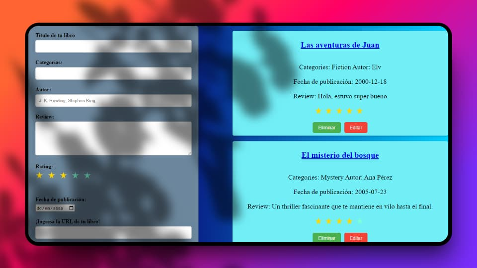

# Book Review App

Esta es una aplicación web para gestionar reseñas de libros, donde puedes agregar, editar y eliminar reseñas. Cada reseña incluye el título del libro, una reseña, una calificación y botones para editar o eliminar la reseña.

## Funcionalidades

- **Agregar reseñas**: Rellena el formulario con el título del libro, tu reseña y una calificación para añadir una nueva reseña a la lista.
- **Editar reseñas**: Puedes editar el título, reseña y calificación de cualquier libro usando el botón de editar en cada card.
- **Eliminar reseñas**: Elimina reseñas no deseadas utilizando el botón de eliminar en cada card.

## Tecnologías Utilizadas

- **React**: Biblioteca de JavaScript para construir la interfaz de usuario.
- **CSS**: Para estilos personalizados de la aplicación.

## Cómo Ejecutar el Proyecto

1. **Clona este repositorio**:
  ```bash
  gh repo clone GersonGarciaKatowhu/crudBooks
```
2. **Instala las dependencias**:
```bash
  npm i
```
2. **Inicia la aplicación**:
```bash
  npm run dev
```

